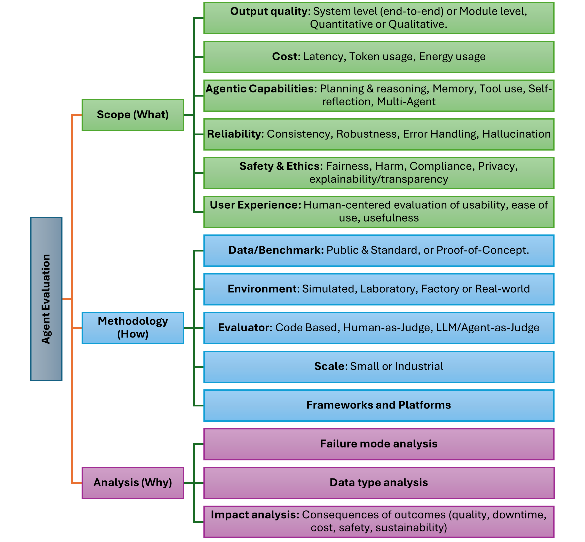

# Manufacturing-Agentic-Evaluation

> **A curated collection of research papers on the evaluation of Agentic AI and LLM-based systems in manufacturing (2024–2025), organized by scope, methodology, and analysis.**

---

## 📖 Overview

This repository provides a comprehensive and organized list of peer-reviewed papers and preprints focusing on **evaluation methodologies for agentic AI systems in manufacturing**.
It is based on the paper:
**“Evaluating Agentic AI Systems in Manufacturing: A Review of Taxonomy, Challenges, and Future Directions”**
*(Nastaran Moradzadeh Farid, Sara Shafiee – submitted for review to the 33rd CIRP Conference on Life Cycle Engineering, 2026)*

Large Language Models (LLMs) and agentic Artificial Intelligence (AI) systems are rapidly transforming the landscape of intelligent automation by enabling autonomous decision-making, planning, and interaction with complex environments. As these systems grow in capability and complexity, evaluating their performance becomes increasingly critical, yet remains a substantial challenge. In manufacturing, where agentic AI is increasingly applied to tasks such as predictive maintenance and quality control, standardized evaluation frameworks are still lacking. Prior research has proposed structured categories for this purpose in general scope, such as analyzing submodules like tool use, reasoning, memory, and self-learning, or evaluating overall high-level performance. In this paper, we aim to review the evaluation approaches of agentic AI systems, with a specific focus on applications in manufacturing and studies released between 2024-2025 and proposes a three-dimensional taxonomy spanning scope, methodology, and analysis. Reviewing 30+ studies, we find evaluations are mostly small-scale proofs of concept with limited metrics, while reliability, safety, and large-scale benchmarking are overlooked. We propose a taxonomy and a reporting checklist to improve reproducibility and transparency. Our synthesis highlights gaps and offers guidelines for future industrial pilots.

---

## 📚 Table of Contents

- [📖 Overview](#-overview)
- [🗂 Paper List](#-paper-list)
    - [Surveys and Reviews](#surveys-and-reviews)
    - [Taxonomy of Evaluation](#taxonomy-of-evaluation)
        - [Scope — what is evaluated](#scope--what-is-evaluated)
        - [Methodology — how evaluation is performed](#methodology--how-evaluation-is-performed)
        - [Analysis — why systems fail and their impact](#analysis--why-systems-fail-and-their-impact)
- [📌 Citation](#-citation)
---

## 🗂 Paper List

### Surveys and Reviews

* `arxiv` [Yehudai A, Eden L, Li A, Uziel G, Zhao Y, Bar-Haim R, et al. Survey on Evaluation of LLM-based Agents. 2025.](https://arxiv.org/abs/2503.16416)
* `arxiv` [Guan S, Xiong H, Wang J, Bian J, Zhu B, Lou J. Evaluating LLM-based Agents for Multi-Turn Conversations: A Survey. 2025.](https://arxiv.org/abs/2503.22458)
* `arxiv` [Zhu J, Zhu M, Rui R, Shan R, Zheng C, Chen B, et al. Evolutionary Perspectives on the Evaluation of LLM-Based AI Agents: A Comprehensive Survey. 2025.](https://arxiv.org/abs/2506.11102)
* [Mohammadi M, Li Y, Lo J, Yip W. Evaluation and Benchmarking of LLM Agents: A Survey. KDD ’25: Proceedings of the 31st ACM SIGKDD Conference on Knowledge Discovery and Data Mining 2025;11:6129–39.](https://doi.org/10.1145/3711896.3736570)
* [Yu M, Meng F, Zhou X, Wang S, Mao J, Pan L, et al. A Survey on Trustworthy LLM Agents: Threats and Countermeasures. KDD ’25: Proceedings of the 31st ACM SIGKDD Conference on Knowledge Discovery and Data Mining n.d.;25.](https://doi.org/10.1145/3711896.3736561)
* [Xi Z, Chen W, Guo X, He W, Ding Y, Hong B, et al. The rise and potential of large language model based agents: a survey. Science China Information Sciences 2025;68.](https://doi.org/10.1007/s11432-024-4222-0)
* [Wang L, Ma C, Feng X, Zhang Z, Yang H, Zhang J, et al. A survey on large language model based autonomous agents. Front Comput Sci 2024;18:1–26.](https://doi.org/10.1007/S11704-024-40231-1/METRICS)
* [Dong X, Zhang X, Bu W, Zhang D, Cao F. A Survey of LLM-based Agents: Theories, Technologies, Applications and Suggestions. 2024 3rd International Conference on Artificial Intelligence, Internet of Things and Cloud Computing Technology, AIoTC 2024 2024:407–13.](https://doi.org/10.1109/AIOTC63215.2024.10748304)
* [Xu W, Huang C, Gao S, Shang S. LLM-Based Agents for Tool Learning: A Survey. Data Sci Eng 2025.](https://doi.org/10.1007/S41019-025-00296-9)
* `arxiv` [Zhang C, He S, Qian J, Li B, Li L, Qin S, et al. Large Language Model-Brained GUI Agents: A Survey. 2025.](https://arxiv.org/abs/2411.18279)
* `arxiv` [Ferrag MA, Tihanyi N, Debbah M. From LLM Reasoning to Autonomous AI Agents: A Comprehensive Review. 2025.](https://arxiv.org/abs/2504.19678)
* `arxiv` [Chen Q, Qin L, Liu J, Peng D, Guan J, Wang P, et al. Towards Reasoning Era: A Survey of Long Chain-of-Thought for Reasoning Large Language Models. 2025.](https://arxiv.org/abs/2503.09567)
* `arxiv` [Singh A, Ehtesham A, Kumar S, Khoei TT. Agentic Retrieval-Augmented Generation: A Survey on Agentic RAG. 2025.](https://arxiv.org/abs/2501.09136)

### Taxonomy of Evaluation

#### Scope — what is evaluated
  *(output quality, cost, agentic capabilities, reliability, safety & ethics, user experience)*

* **Output quality:**
    * `14` [Yuan Z, Li M, Liu C, Han F, Huang H, Dai HN. Chat with MES: LLM-driven user interface for manipulating garment manufacturing system through natural language. J Manuf Syst 2025;80:1093–107.](https://doi.org/10.1016/J.JMSY.2025.02.008)
    * `15` `arxiv` [Zhang B, Luo P. OR-LLM-Agent: Automating Modeling and Solving of Operations Research Optimization Problem with Reasoning Large Language Model. 2025.](https://arxiv.org/abs/2503.10009)
    * `16` [Gautam A, Aryal MR, Deshpande S, Padalkar S, Nikolaenko M, Tang M, et al. IIoT-enabled digital twin for legacy and smart factory machines with LLM integration. J Manuf Syst 2025;80:511–23.](https://doi.org/10.1016/J.JMSY.2025.03.022)
    * `17` [Jeon J, Sim Y, Lee H, Han C, Yun D, Kim E, et al. ChatCNC: Conversational machine monitoring via large language model and real-time data retrieval augmented generation. J Manuf Syst 2025;79:504–14.](https://doi.org/10.1016/J.JMSY.2025.01.018)
    * `18` [Fan H, Liu X, Fuh JYH, Lu WF, Li B. Embodied intelligence in manufacturing: leveraging large language models for autonomous industrial robotics. J Intell Manuf 2025;36:1141–57.](https://doi.org/10.1007/S10845-023-02294-Y/FIGURES/7)
    * `19` [Hizmi B El, Sterman Y, Austern G.. Special Issue: CAADRIA 2025 LLMto3D-Generation of parametric, 3D printable objects using large language models. International Journal of Architectural Computing 2025;0:1–19.](https://doi.org/10.1177/14780771251353792)
    * `20` [Garcia CI, DiBattista MA, Letelier TA, Halloran HD, Camelio JA. Framework for LLM applications in manufacturing. Manuf Lett 2024;41:253–63.](https://doi.org/10.1016/J.MFGLET.2024.09.030)
    * `21` [Lim J, Vogel-Heuser B, Kovalenko I. Large Language Model-Enabled Multi-Agent Manufacturing Systems. IEEE International Conference on Automation Science and Engineering 2024:3940–6.](https://doi.org/10.1109/CASE59546.2024.10711432)
    * `22` `arxiv` [Jannelli V, Schöpf S, Bickel M, Netland T, Brintrup A. Agentic LLMs in the Supply Chain: Towards Autonomous Multi-Agent Consensus-Seeking. 2024.](https://arxiv.org/abs/2411.10184)
    * `23` [Holland M, Chaudhari K. Large language model based agent for process planning of fiber composite structures. Manuf Lett 2024;40:100–3.](https://doi.org/10.1016/J.MFGLET.2024.03.010)
    * `24` `arxiv` [Romero ML, Suyama R. Agentic AI for Intent-Based Industrial Automation.](https://arxiv.org/abs/2506.04980)
    * `25` [Farimani AB, Pak P. LLM-3D Print: Large Language Models To Monitor and Control 3D Printing 2024.](https://doi.org/10.21203/rs.3.rs-4945366/v1)
    * `26` [Wang T, Fan J, Zheng P. An LLM-based vision and language cobot navigation approach for Human-centric Smart Manufacturing. J Manuf Syst 2024;75:299–305.](https://doi.org/10.1016/J.JMSY.2024.04.020)
    * `27` [Xu S, Wei Y, Zheng P, Zhang J, Yu C. LLM enabled generative collaborative design in a mixed reality environment. J Manuf Syst 2024;74:703–15.](https://doi.org/10.1016/J.JMSY.2024.04.030)

* Cost: 
    * `14` [Yuan Z, Li M, Liu C, Han F, Huang H, Dai HN. Chat with MES: LLM-driven user interface for manipulating garment manufacturing system through natural language. J Manuf Syst 2025;80:1093–107.](https://doi.org/10.1016/J.JMSY.2025.02.008)
    * `16` [Gautam A, Aryal MR, Deshpande S, Padalkar S, Nikolaenko M, Tang M, et al. IIoT-enabled digital twin for legacy and smart factory machines with LLM integration. J Manuf Syst 2025;80:511–23.](https://doi.org/10.1016/J.JMSY.2025.03.022)
    * `22` `arxiv` [Jannelli V, Schöpf S, Bickel M, Netland T, Brintrup A. Agentic LLMs in the Supply Chain: Towards Autonomous Multi-Agent Consensus-Seeking. 2024.](https://arxiv.org/abs/2411.10184)
    * `27` [Xu S, Wei Y, Zheng P, Zhang J, Yu C. LLM enabled generative collaborative design in a mixed reality environment. J Manuf Syst 2024;74:703–15.](https://doi.org/10.1016/J.JMSY.2024.04.030)
    * `28` [Zhuang W, Pan X, Wen S, Yu W, Li X, Bao J. Large language model-enabled multi-agent self-organised approach for personalised rehabilitation assistive devices design. Int J Prod Res 2025.](https://doi.org/10.1080/00207543.2025.2509155)
    * `29` `arxiv` [Lee J, Kim J-Y, Kim H, Lee I, Ryu S. IM-Chat: A Multi-agent LLM-based Framework for Knowledge Transfer in Injection Molding Industry. 2025.](https://arxiv.org/abs/2507.15268)
    * `30` [Liu C, Nie Q. A blockchain-based LLM-driven energy-efficient scheduling system towards distributed multi-agent manufacturing scenario of new energy vehicles within the circular economy. Comput Ind Eng 2025;201:110889.](https://doi.org/10.1016/J.CIE.2025.110889)
    * `31` [Liu C, Song J, Tang D, Wang L, Zhu H, Cai Q. Probing a novel machine tool fault reasoning and maintenance service recommendation approach through data-knowledge empowered LLMs integrated with AR-assisted maintenance guidance. Advanced Engineering Informatics 2025;66:103460.](https://doi.org/10.1016/J.AEI.2025.103460)

* Agentic capabilities: 
    * `14` [Yuan Z, Li M, Liu C, Han F, Huang H, Dai HN. Chat with MES: LLM-driven user interface for manipulating garment manufacturing system through natural language. J Manuf Syst 2025;80:1093–107.](https://doi.org/10.1016/J.JMSY.2025.02.008)
    * `16` [Gautam A, Aryal MR, Deshpande S, Padalkar S, Nikolaenko M, Tang M, et al. IIoT-enabled digital twin for legacy and smart factory machines with LLM integration. J Manuf Syst 2025;80:511–23.](https://doi.org/10.1016/J.JMSY.2025.03.022)
    * `20` [Garcia CI, DiBattista MA, Letelier TA, Halloran HD, Camelio JA. Framework for LLM applications in manufacturing. Manuf Lett 2024;41:253–63.](https://doi.org/10.1016/J.MFGLET.2024.09.030)
    * `24` `arxiv` [Romero ML, Suyama R. Agentic AI for Intent-Based Industrial Automation.](https://arxiv.org/abs/2506.04980)
    * `28` [Zhuang W, Pan X, Wen S, Yu W, Li X, Bao J. Large language model-enabled multi-agent self-organised approach for personalised rehabilitation assistive devices design. Int J Prod Res 2025.](https://doi.org/10.1080/00207543.2025.2509155)
    * `29` `arxiv` [Lee J, Kim J-Y, Kim H, Lee I, Ryu S. IM-Chat: A Multi-agent LLM-based Framework for Knowledge Transfer in Injection Molding Industry. 2025.](https://arxiv.org/abs/2507.15268)
    * `31` [Liu C, Song J, Tang D, Wang L, Zhu H, Cai Q. Probing a novel machine tool fault reasoning and maintenance service recommendation approach through data-knowledge empowered LLMs integrated with AR-assisted maintenance guidance. Advanced Engineering Informatics 2025;66:103460.](https://doi.org/10.1016/J.AEI.2025.103460)
    * `32` [Barbosa R, Santos R, Novais P. Collaborative Problem-Solving with LLM: A Multi-agent System Approach to Solve Complex Tasks Using Autogen. Communications in Computer and Information Science 2025;2149 CCIS:203–14.](https://doi.org/10.1007/978-3-031-73058-0_17)

* Reliability: 
    * `15` `arxiv` [Zhang B, Luo P. OR-LLM-Agent: Automating Modeling and Solving of Operations Research Optimization Problem with Reasoning Large Language Model. 2025.](https://arxiv.org/abs/2503.10009)
    * `17` [Jeon J, Sim Y, Lee H, Han C, Yun D, Kim E, et al. ChatCNC: Conversational machine monitoring via large language model and real-time data retrieval augmented generation. J Manuf Syst 2025;79:504–14.](https://doi.org/10.1016/J.JMSY.2025.01.018)
    * `31` [Liu C, Song J, Tang D, Wang L, Zhu H, Cai Q. Probing a novel machine tool fault reasoning and maintenance service recommendation approach through data-knowledge empowered LLMs integrated with AR-assisted maintenance guidance. Advanced Engineering Informatics 2025;66:103460.](https://doi.org/10.1016/J.AEI.2025.103460)
    * `33` [Ghidary SS, Chen D, Mohammadi F, Petrilli Barcelo AE, Salazar Luces JV, Hirata Y. Innovating Robotic Garment Handling Through the Integration of Large Language Models and Behavior Trees. IEEE International Conference on Robotics and Biomimetics, ROBIO 2024:595–600.](https://doi.org/10.1109/ROBIO64047.2024.10907326)
    * `34` [Sun Y, Zhang Q, Bao J, Lu Y, Liu S. Empowering digital twins with large language models for global temporal feature learning. J Manuf Syst 2024;74:83–99.](https://doi.org/10.1016/J.JMSY.2024.02.015)

* Safety and ethics:
    * `24` `arxiv` [Romero ML, Suyama R. Agentic AI for Intent-Based Industrial Automation.]
    * `30` [Liu C, Nie Q. A blockchain-based LLM-driven energy-efficient scheduling system towards distributed multi-agent manufacturing scenario of new energy vehicles within the circular economy. Comput Ind Eng 2025;201:110889.](https://doi.org/10.1016/J.CIE.2025.110889)
    * `35` `arxiv` [Han Y, Guo Z. Regulator-Manufacturer AI Agents Modeling: Mathematical Feedback-Driven Multi-Agent LLM Framework 2024.](https://arxiv.org/abs/2411.15356)

* User experience: 
    * `17` [Jeon J, Sim Y, Lee H, Han C, Yun D, Kim E, et al. ChatCNC: Conversational machine monitoring via large language model and real-time data retrieval augmented generation. J Manuf Syst 2025;79:504–14.](https://doi.org/10.1016/J.JMSY.2025.01.018)
    * `28` [Zhuang W, Pan X, Wen S, Yu W, Li X, Bao J. Large language model-enabled multi-agent self-organised approach for personalised rehabilitation assistive devices design. Int J Prod Res 2025.](https://doi.org/10.1080/00207543.2025.2509155)
    * `31` [Liu C, Song J, Tang D, Wang L, Zhu H, Cai Q. Probing a novel machine tool fault reasoning and maintenance service recommendation approach through data-knowledge empowered LLMs integrated with AR-assisted maintenance guidance. Advanced Engineering Informatics 2025;66:103460.](https://doi.org/10.1016/J.AEI.2025.103460)
    * `36` [Zhou L, Zhang L, Chen X, Ding Y, Wang Y. The Heuristic Design Innovation Approach for Data-Integrated Large Language Model. Lecture Notes in Computer Science (Including Subseries Lecture Notes in Artificial Intelligence and Lecture Notes in Bioinformatics) 2024;14736 LNAI:170–95.](https://doi.org/10.1007/978-3-031-60615-1_12)

#### **Methodology — how evaluation is performed**
  *(data & benchmarks, environment, evaluator, scale, frameworks & platforms)*

* Data & benchmarks: 
    * `14` [Yuan Z, Li M, Liu C, Han F, Huang H, Dai HN. Chat with MES: LLM-driven user interface for manipulating garment manufacturing system through natural language. J Manuf Syst 2025;80:1093–107.](https://doi.org/10.1016/J.JMSY.2025.02.008) `Synthetic benchmark`
    * `18` [Fan H, Liu X, Fuh JYH, Lu WF, Li B. Embodied intelligence in manufacturing: leveraging large language models for autonomous industrial robotics. J Intell Manuf 2025;36:1141–57.](https://doi.org/10.1007/S10845-023-02294-Y/FIGURES/7) `Proof-of-concept`
    * `19` [Hizmi B El, Sterman Y, Austern G.. Special Issue: CAADRIA 2025 LLMto3D-Generation of parametric, 3D printable objects using large language models. International Journal of Architectural Computing 2025;0:1–19.](https://doi.org/10.1177/14780771251353792)
    * `20` [Garcia CI, DiBattista MA, Letelier TA, Halloran HD, Camelio JA. Framework for LLM applications in manufacturing. Manuf Lett 2024;41:253–63.](https://doi.org/10.1016/J.MFGLET.2024.09.030) `Proof-of-concept`
    * `24` `arxiv` [Romero ML, Suyama R. Agentic AI for Intent-Based Industrial Automation.](https://arxiv.org/abs/2506.04980) `Proof-of-concept`
    * `37` [Zhao X, Kuang W, Kim YW. Leveraging Multi-agent System Powered by Large Language Model to Improve Transparency and Reliability in Automated Supply Chain Coordination. Annual Conference of the International Group for Lean Construction, IGLC 2025;33:681–92.](https://doi.org/10.24928/2025/0102) `Proof-of-concept`

* Environment: 
    * `16` [Gautam A, Aryal MR, Deshpande S, Padalkar S, Nikolaenko M, Tang M, et al. IIoT-enabled digital twin for legacy and smart factory machines with LLM integration. J Manuf Syst 2025;80:511–23.](https://doi.org/10.1016/J.JMSY.2025.03.022) `Controlled lab`
    * `18` [Fan H, Liu X, Fuh JYH, Lu WF, Li B. Embodied intelligence in manufacturing: leveraging large language models for autonomous industrial robotics. J Intell Manuf 2025;36:1141–57.](https://doi.org/10.1007/S10845-023-02294-Y/FIGURES/7) `Controlled lab`
    * `21` [Lim J, Vogel-Heuser B, Kovalenko I. Large Language Model-Enabled Multi-Agent Manufacturing Systems. IEEE International Conference on Automation Science and Engineering 2024:3940–6.](https://doi.org/10.1109/CASE59546.2024.10711432) `Simulation / game`
    * `26` [Wang T, Fan J, Zheng P. An LLM-based vision and language cobot navigation approach for Human-centric Smart Manufacturing. J Manuf Syst 2024;75:299–305.](https://doi.org/10.1016/J.JMSY.2024.04.020) `Simulation / game`
    * `31` [Liu C, Song J, Tang D, Wang L, Zhu H, Cai Q. Probing a novel machine tool fault reasoning and maintenance service recommendation approach through data-knowledge empowered LLMs integrated with AR-assisted maintenance guidance. Advanced Engineering Informatics 2025;66:103460.](https://doi.org/10.1016/J.AEI.2025.103460) `Hybrid shop-floor`
    * `32` [Barbosa R, Santos R, Novais P. Collaborative Problem-Solving with LLM: A Multi-agent System Approach to Solve Complex Tasks Using Autogen. Communications in Computer and Information Science 2025;2149 CCIS:203–14.](https://doi.org/10.1007/978-3-031-73058-0_17) `Simulation / game`
    * `33` [Ghidary SS, Chen D, Mohammadi F, Petrilli Barcelo AE, Salazar Luces JV, Hirata Y. Innovating Robotic Garment Handling Through the Integration of Large Language Models and Behavior Trees. IEEE International Conference on Robotics and Biomimetics, ROBIO 2024:595–600.](https://doi.org/10.1109/ROBIO64047.2024.10907326) `Controlled lab`
    * `38` [Berlec T, Corn M, Varljen S, Podržaj P. Exploring Decentralized Warehouse Management Using Large Language Models: A Proof of Concept. Applied Sciences 2025, Vol 15, Page 5734 2025;15:5734.](https://doi.org/10.3390/APP15105734) `Simulation`
    * `39` [Xia L, Li C, Zhang C, Liu S, Zheng P. Leveraging error-assisted fine-tuning large language models for manufacturing excellence. Robot Comput Integr Manuf 2024;88:102728.](https://doi.org/10.1016/J.RCIM.2024.102728) `Simulation / game`
    * `40` `arxiv` [Zhao Z, Tang D, Zhu H, Zhang Z, Chen K, Liu C, et al. A Large Language Model-based multi-agent manufacturing system for intelligent shopfloor. 2024.](https://arxiv.org/abs/2405.16887) `Hybrid testbed`
    * `41` [Lin CY, Tsai TH, Tseng TL. Generative AI for Intelligent Manufacturing Virtual Assistants in the Semiconductor Industry. IEEE Robot Autom Lett 2025;10:4132–9.](https://doi.org/10.1109/LRA.2025.3544506) `Pilot (industrial)`

* Evaluator: 
    * `14` [Yuan Z, Li M, Liu C, Han F, Huang H, Dai HN. Chat with MES: LLM-driven user interface for manipulating garment manufacturing system through natural language. J Manuf Syst 2025;80:1093–107.](https://doi.org/10.1016/J.JMSY.2025.02.008) `Automated` `LLM-as-judge`
    * `17` [Jeon J, Sim Y, Lee H, Han C, Yun D, Kim E, et al. ChatCNC: Conversational machine monitoring via large language model and real-time data retrieval augmented generation. J Manuf Syst 2025;79:504–14.](https://doi.org/10.1016/J.JMSY.2025.01.018) `Human experts/operators` 
    * `19` [Hizmi B El, Sterman Y, Austern G.. Special Issue: CAADRIA 2025 LLMto3D-Generation of parametric, 3D printable objects using large language models. International Journal of Architectural Computing 2025;0:1–19.](https://doi.org/10.1177/14780771251353792) `Human experts`
    * `28` [Zhuang W, Pan X, Wen S, Yu W, Li X, Bao J. Large language model-enabled multi-agent self-organised approach for personalised rehabilitation assistive devices design. Int J Prod Res 2025.](https://doi.org/10.1080/00207543.2025.2509155) `Human experts`
    * `29` `arxiv` [Lee J, Kim J-Y, Kim H, Lee I, Ryu S. IM-Chat: A Multi-agent LLM-based Framework for Knowledge Transfer in Injection Molding Industry. 2025.](https://arxiv.org/abs/2507.15268) `Human experts + LLM-as-judge`
    * `30` [Liu C, Nie Q. A blockchain-based LLM-driven energy-efficient scheduling system towards distributed multi-agent manufacturing scenario of new energy vehicles within the circular economy. Comput Ind Eng 2025;201:110889.](https://doi.org/10.1016/J.CIE.2025.110889) `Automated`
    * `31` [Liu C, Song J, Tang D, Wang L, Zhu H, Cai Q. Probing a novel machine tool fault reasoning and maintenance service recommendation approach through data-knowledge empowered LLMs integrated with AR-assisted maintenance guidance. Advanced Engineering Informatics 2025;66:103460.](https://doi.org/10.1016/J.AEI.2025.103460) `Automated`
    * `36` [Zhou L, Zhang L, Chen X, Ding Y, Wang Y. The Heuristic Design Innovation Approach for Data-Integrated Large Language Model. Lecture Notes in Computer Science (Including Subseries Lecture Notes in Artificial Intelligence and Lecture Notes in Bioinformatics) 2024;14736 LNAI:170–95.](https://doi.org/10.1007/978-3-031-60615-1_12) `Human participants`
    * `40` `arxiv` [Zhao Z, Tang D, Zhu H, Zhang Z, Chen K, Liu C, et al. A Large Language Model-based multi-agent manufacturing system for intelligent shopfloor. 2024.](https://arxiv.org/abs/2405.16887) `Automated`
    * `42` [Wu T, Li J, Bao J, Liu Q. ProcessCarbonAgent: A large language models-empowered autonomous agent for decision-making in manufacturing carbon emission management. J Manuf Syst 2024;76:429–42.](https://doi.org/10.1016/J.JMSY.2024.08.008) `Automated + Human + LLM-as-judge`

* Scale: 
    * `17` [Jeon J, Sim Y, Lee H, Han C, Yun D, Kim E, et al. ChatCNC: Conversational machine monitoring via large language model and real-time data retrieval augmented generation. J Manuf Syst 2025;79:504–14.](https://doi.org/10.1016/J.JMSY.2025.01.018) `Small/lab-scale`
    * `18` [Fan H, Liu X, Fuh JYH, Lu WF, Li B. Embodied intelligence in manufacturing: leveraging large language models for autonomous industrial robotics. J Intell Manuf 2025;36:1141–57.](https://doi.org/10.1007/S10845-023-02294-Y/FIGURES/7) `Small/lab-scale`
    * `19` [Hizmi B El, Sterman Y, Austern G.. Special Issue: CAADRIA 2025 LLMto3D-Generation of parametric, 3D printable objects using large language models. International Journal of Architectural Computing 2025;0:1–19.](https://doi.org/10.1177/14780771251353792) `Small/lab-scale`
    * `20` [Garcia CI, DiBattista MA, Letelier TA, Halloran HD, Camelio JA. Framework for LLM applications in manufacturing. Manuf Lett 2024;41:253–63.](https://doi.org/10.1016/J.MFGLET.2024.09.030) `Small/lab-scale`
    * `23` [Holland M, Chaudhari K. Large language model based agent for process planning of fiber composite structures. Manuf Lett 2024;40:100–3.](https://doi.org/10.1016/J.MFGLET.2024.03.010) `Small/lab-scale`
    * `24` `arxiv` [Romero ML, Suyama R. Agentic AI for Intent-Based Industrial Automation.](https://arxiv.org/abs/2506.04980) `Small/lab-scale`
    * `25` [Farimani AB, Pak P. LLM-3D Print: Large Language Models To Monitor and Control 3D Printing 2024.](https://doi.org/10.21203/rs.3.rs-4945366/v1) `Small/lab-scale`
    * `30` [Liu C, Nie Q. A blockchain-based LLM-driven energy-efficient scheduling system towards distributed multi-agent manufacturing scenario of new energy vehicles within the circular economy. Comput Ind Eng 2025;201:110889.](https://doi.org/10.1016/J.CIE.2025.110889) `Pilot deployment`
    * `31` [Liu C, Song J, Tang D, Wang L, Zhu H, Cai Q. Probing a novel machine tool fault reasoning and maintenance service recommendation approach through data-knowledge empowered LLMs integrated with AR-assisted maintenance guidance. Advanced Engineering Informatics 2025;66:103460.](https://doi.org/10.1016/J.AEI.2025.103460) `Mid-scale hybrid`
    * `33` [Ghidary SS, Chen D, Mohammadi F, Petrilli Barcelo AE, Salazar Luces JV, Hirata Y. Innovating Robotic Garment Handling Through the Integration of Large Language Models and Behavior Trees. IEEE International Conference on Robotics and Biomimetics, ROBIO 2024:595–600.](https://doi.org/10.1109/ROBIO64047.2024.10907326) `Small/lab-scale`
    * `37` [Zhao X, Kuang W, Kim YW. Leveraging Multi-agent System Powered by Large Language Model to Improve Transparency and Reliability in Automated Supply Chain Coordination. Annual Conference of the International Group for Lean Construction, IGLC 2025;33:681–92.](https://doi.org/10.24928/2025/0102) `Small/lab-scale`
    * `39` [Xia L, Li C, Zhang C, Liu S, Zheng P. Leveraging error-assisted fine-tuning large language models for manufacturing excellence. Robot Comput Integr Manuf 2024;88:102728.](https://doi.org/10.1016/J.RCIM.2024.102728) `Small/lab-scale`
    * `40` `arxiv` [Zhao Z, Tang D, Zhu H, Zhang Z, Chen K, Liu C, et al. A Large Language Model-based multi-agent manufacturing system for intelligent shopfloor. 2024.](https://arxiv.org/abs/2405.16887) `Mid-scale hybrid`
    * `41` [Lin CY, Tsai TH, Tseng TL. Generative AI for Intelligent Manufacturing Virtual Assistants in the Semiconductor Industry. IEEE Robot Autom Lett 2025;10:4132–9.](https://doi.org/10.1109/LRA.2025.3544506) `Pilot deployment`

* Frameworks & platforms: 
    * `43` [openai/evals: Evals is a framework for evaluating LLMs and LLM systems, and an open-source registry of benchmarks. n.d.](https://github.com/openai/evals)
    * `44` [Vertex AI Platform | Google Cloud n.d..](https://cloud.google.com/vertex-ai)
    * `45` [LangGraph Platform n.d. .](https://www.langchain.com/langgraph-platform)
    * `46` [AI Agents – Amazon Bedrock Agents – AWS n.d.](https://aws.amazon.com/bedrock/agents/)

#### **Analysis — why systems fail and their impact**
  *(failure-mode analysis, data type analysis, business/operational impact)*

* Failure modes: 
    * `14` [Yuan Z, Li M, Liu C, Han F, Huang H, Dai HN. Chat with MES: LLM-driven user interface for manipulating garment manufacturing system through natural language. J Manuf Syst 2025;80:1093–107.](https://doi.org/10.1016/J.JMSY.2025.02.008)
    * `17` [Jeon J, Sim Y, Lee H, Han C, Yun D, Kim E, et al. ChatCNC: Conversational machine monitoring via large language model and real-time data retrieval augmented generation. J Manuf Syst 2025;79:504–14.](https://doi.org/10.1016/J.JMSY.2025.01.018)
    * `21` [Lim J, Vogel-Heuser B, Kovalenko I. Large Language Model-Enabled Multi-Agent Manufacturing Systems. IEEE International Conference on Automation Science and Engineering 2024:3940–6.](https://doi.org/10.1109/CASE59546.2024.10711432)
    * `33` [Ghidary SS, Chen D, Mohammadi F, Petrilli Barcelo AE, Salazar Luces JV, Hirata Y. Innovating Robotic Garment Handling Through the Integration of Large Language Models and Behavior Trees. IEEE International Conference on Robotics and Biomimetics, ROBIO 2024:595–600.](https://doi.org/10.1109/ROBIO64047.2024.10907326)

* Data type analysis: 
    * `14` [Yuan Z, Li M, Liu C, Han F, Huang H, Dai HN. Chat with MES: LLM-driven user interface for manipulating garment manufacturing system through natural language. J Manuf Syst 2025;80:1093–107.](https://doi.org/10.1016/J.JMSY.2025.02.008)
    * `15` `arxiv` [Zhang B, Luo P. OR-LLM-Agent: Automating Modeling and Solving of Operations Research Optimization Problem with Reasoning Large Language Model. 2025.](https://arxiv.org/abs/2503.10009)
    * `17` [Jeon J, Sim Y, Lee H, Han C, Yun D, Kim E, et al. ChatCNC: Conversational machine monitoring via large language model and real-time data retrieval augmented generation. J Manuf Syst 2025;79:504–14.](https://doi.org/10.1016/J.JMSY.2025.01.018)
    * `31` [Liu C, Song J, Tang D, Wang L, Zhu H, Cai Q. Probing a novel machine tool fault reasoning and maintenance service recommendation approach through data-knowledge empowered LLMs integrated with AR-assisted maintenance guidance. Advanced Engineering Informatics 2025;66:103460.](https://doi.org/10.1016/J.AEI.2025.103460)
    * `39` [Xia L, Li C, Zhang C, Liu S, Zheng P. Leveraging error-assisted fine-tuning large language models for manufacturing excellence. Robot Comput Integr Manuf 2024;88:102728.](https://doi.org/10.1016/J.RCIM.2024.102728)

* Impact: 
    * `30` [Liu C, Nie Q. A blockchain-based LLM-driven energy-efficient scheduling system towards distributed multi-agent manufacturing scenario of new energy vehicles within the circular economy. Comput Ind Eng 2025;201:110889.](https://doi.org/10.1016/J.CIE.2025.110889)
    * `31` [Liu C, Song J, Tang D, Wang L, Zhu H, Cai Q. Probing a novel machine tool fault reasoning and maintenance service recommendation approach through data-knowledge empowered LLMs integrated with AR-assisted maintenance guidance. Advanced Engineering Informatics 2025;66:103460.](https://doi.org/10.1016/J.AEI.2025.103460)
    * `38` [Berlec T, Corn M, Varljen S, Podržaj P. Exploring Decentralized Warehouse Management Using Large Language Models: A Proof of Concept. Applied Sciences 2025, Vol 15, Page 5734 2025;15:5734.](https://doi.org/10.3390/APP15105734)
    * `40` `arxiv` [Zhao Z, Tang D, Zhu H, Zhang Z, Chen K, Liu C, et al. A Large Language Model-based multi-agent manufacturing system for intelligent shopfloor. 2024.](https://arxiv.org/abs/2405.16887)
    * `47` [Wang Z, Qin H. Intelligent industrial production process automatic regulation system based on LLM agents. 2024 5th International Conference on Artificial Intelligence and Electromechanical Automation, AIEA 2024 2024:133–7.](https://doi.org/10.1109/AIEA62095.2024.10692701)

## 📌 Citation

If you use this repository or its organization in your work, please cite:

**TBD** (preprint/DOI link to be added upon publication).
